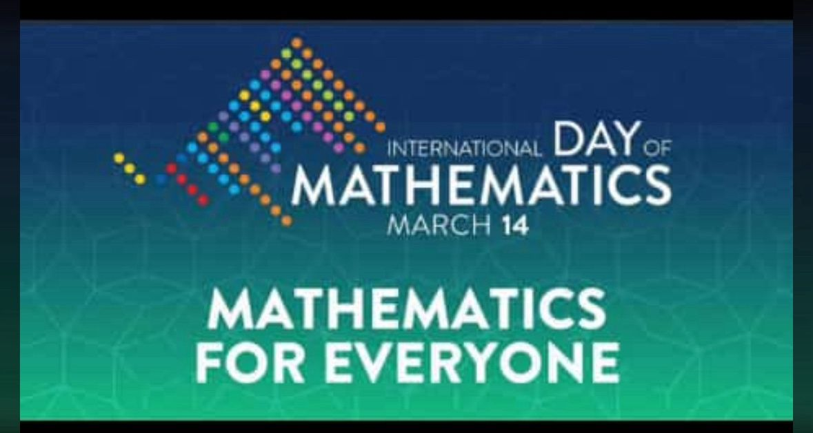

authors:
  - admin

tags:
  - Mathematics

categories:
  - Blog
  - Inspiration
# 

🤗 My Brain is Open ~ Paul Erdos. 

🤗 I like crossing the imaginary boundaries people set up between different fields - it's very refreshing ~ Maryam Mirzakhani.

🤗 You don't have to be a mathematician to have a feel for numbers ~ John Nash. 

 🤗 The beauty of mathematics only shows itself to more patient followers ~ Maryam Mirzakhani. 

🤗 Being Head of State or of Government, if I must be one, is just a necessary tool to achieve my sole aim of bringing about a scientific technological revolution in the fatherland ~ Chike Obi. 

🤗 To me, mathematics, computer science, and the arts are insanely related. They’re all creative expressions ~ Sebastian Thrun.

🤗 Mathematics is the most beautiful and most powerful creation of the human spirit ~ Stefan Banach. 

🤗 Mathematics is the language in which God has written the universe~ Galileo Galilei.

🤗 Life is like a number line, no matter the point you’re at, there is one greater and lesser than you. Remain humble, stay positive and hope for the best ~ Faithful C. Onwuegbuche.
